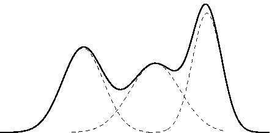
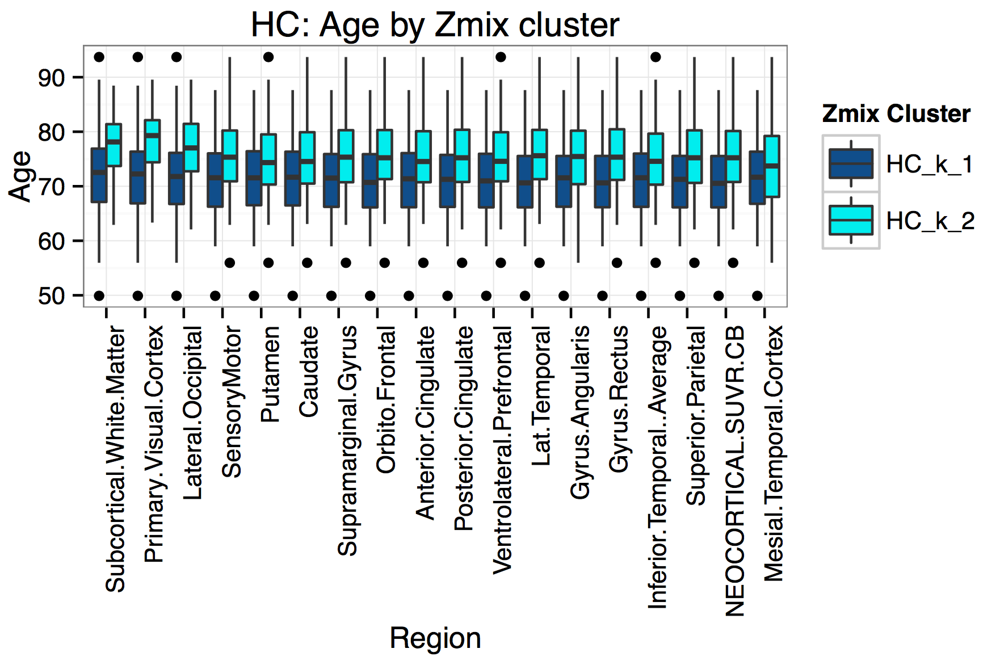

```{r, echo = FALSE}
knitr::opts_chunk$set(
  message = FALSE,
  warning = FALSE,
  collapse = TRUE,
  comment = "#>",
  fig.align = "center",
  cache = FALSE
)
```

```{r, echo=FALSE, include=FALSE, cache=TRUE}
# OPTIONS
require(knitr)
# Set opts_knit
opts_knit$set(cache = TRUE,
	            error = TRUE,
              fig.height = 6, 
              fig.width = 8,
              pointsize=6)

# Set opts_chunk
opts_chunk$set(fig.width=7, fig.height=5, pointsize=8)
load("~/Google Drive/Work/CSIRO_P1/WOMBAT Talk 2016/Results_All_ForPres.RDATA")
```


```{r,echo=FALSE,cache=TRUE}
require(ggplot2, quietly=TRUE)
require(tidyr, quietly=TRUE)

# function:
DensityPlot_HC<-function(ME, BigY_HC_inFunk=BigY_HC, 
                            .All.tp_inFunk=.All.tp){ 
	  y.now=BigY_HC_inFunk[,ME]
    region.now=names(BigY_HC_inFunk)[ME]
    
    # pars:
    pars.now    <-aggregate( Estimate~ variable+k,
      data=.All.tp_inFunk[ .All.tp_inFunk$Region %in% region.now,],
      mean)

    Mix.pars<-list(  "Mu" =c(pars.now[pars.now$variable%in%"Mu",3]),
                     "Var"=c(pars.now[pars.now$variable%in%"Sig",3]),
                     "P"  =c(pars.now[pars.now$variable%in%"P",3]))
  	In <-list("Y"=y.now, "mu"=Mix.pars[[1]], "sigma"=Mix.pars[[2]], "lambda"=Mix.pars[[3]])
    x     <- seq(0.5,4,len=1000)
  	pars    <- data.frame(comp=paste("K",c(1:length(In$lambda)), sep="_"), In$mu, In$sig, In$lambda )
  	em.df   <- data.frame(x=rep(x,each=nrow(pars)),pars)
  	em.df$y <- with(em.df,In.lambda*dnorm(x,mean=In.mu,sd=sqrt(In.sig)))
  	em.df$In.mu<-	factor(em.df$In.mu)
  	
    if(sum(pars.now$k==2)==3) {levels(em.df$In.mu)<-c("HC_k_1", "HC_k_2")
    }else{  levels(em.df$In.mu)<-c("HC_k_1")}

		#model found
		md<-ggplot(data.frame(x=In$Y),aes(x,y=..density..)) + xlab("SUVR")+ylab("Density")+
        geom_histogram(fill="deepskyblue4", alpha = 0.8, binwidth=diff(range(y.now))/50)+
		    geom_polygon(data=em.df,aes(x,y,fill=comp),color="black", alpha=0.5, size=0.2)+
		    scale_fill_manual("Cluster",labels=format(em.df$In.mu,digits=3), values=c( "dodgerblue4", "cyan2"))+ 
		    theme_bw()+
#		  geom_vline(data=pars, aes(xintercept=In.mu),color="black",linetype="dashed", size=0.3)+
#		    theme(legend.position="none")+
#		    annotate("text", x = pars$In.mu[1]-0.01, y =-0.25, label = round(pars$In.mu[1], 2), angle=90, size=2)+ 
		ggtitle(bquote(atop(.(region.now), atop(italic("HC (Blue)")))))+
			 coord_cartesian(ylim= c(-0.5,  max(em.df$y)+0.5))
		
	 return(md)}


# function:
DensityPlot_Both<-function(ME, BigY_HC_inFunk=BigY_HC, 
                            BigY_AD_inFunk=BigY_AD, 
                            .All.tp_inFunk=.All.tp ,
                            .All_AD_inFunk=.All_AD){ 
	  y.now=BigY_HC_inFunk[,ME]
    region.now=names(BigY_HC_inFunk)[ME]
    y.ad.now=BigY_AD_inFunk[,ME]
    
    # pars:
    pars.now    <-aggregate( Estimate~ variable+k,
      data=.All.tp_inFunk[ .All.tp_inFunk$Region %in% region.now,],
      mean)
    .All_AD.tp  <-.All_AD_inFunk[.All_AD_inFunk$TopModel %in% TRUE,]
    pars.now.ad <-aggregate(Estimate~ variable+k,
                           data=.All_AD.tp[ .All_AD.tp$Region %in% region.now,],
                           mean)

    Mix.pars<-list(  "Mu" =c(pars.now.ad[2,3], pars.now[pars.now$variable%in%"Mu",3]),
                     "Var"=c(pars.now.ad[3,3], pars.now[pars.now$variable%in%"Sig",3]),
                     "P"  =c(pars.now.ad[1,3], pars.now[pars.now$variable%in%"P",3]))
  	In <-list("Y"=y.now, "mu"=Mix.pars[[1]], "sigma"=Mix.pars[[2]], "lambda"=Mix.pars[[3]])
    x     <- seq(0.5,4,len=1000)
  	pars    <- data.frame(comp=paste("K",c(1:length(In$lambda)), sep="_"), In$mu, In$sig, In$lambda )
  	em.df   <- data.frame(x=rep(x,each=nrow(pars)),pars)
  	em.df$y <- with(em.df,In.lambda*dnorm(x,mean=In.mu,sd=sqrt(In.sig)))
  	em.df$In.mu<-	factor(em.df$In.mu)
  	
    if(sum(pars.now$k==2)==3) {levels(em.df$In.mu)<-c("HC_k_1", "HC_k_2", "AD_k_1")
    }else{  levels(em.df$In.mu)<-c("HC_k_1", "AD_k_1")}

		#model found
		md<-ggplot(data.frame(x=In$Y),aes(x,y=..density..)) + xlab("SUVR")+ylab("Density")+
		   	geom_histogram( data=data.frame(xad=y.ad.now), aes(xad,y=..density..), fill="firebrick1", alpha = 0.3,binwidth=diff(range(y.ad.now))/50)+
        geom_histogram(fill="deepskyblue4", alpha = 0.8, binwidth=diff(range(y.now))/50)+
		    geom_polygon(data=em.df,aes(x,y,fill=comp),color="black", alpha=0.5, size=0.2)+
		    scale_fill_manual("Cluster",labels=format(em.df$In.mu,digits=3), values=c("firebrick1", "dodgerblue4", "cyan2"))+ 
		    theme_bw()+
#		  geom_vline(data=pars, aes(xintercept=In.mu),color="black",linetype="dashed", size=0.3)+
#		    theme(legend.position="none")+
#		    annotate("text", x = pars$In.mu[1]-0.01, y =-0.25, label = round(pars$In.mu[1], 2), angle=90, size=2)+ 
		ggtitle(bquote(atop(.(region.now), atop(italic("HC (Blue) & AD (Red)")))))+
			 coord_cartesian(ylim= c(-0.5,  max(em.df$y)+0.5))
		
	 return(md)}


```


## Who am I?

- PhD in statistics, from QUT \& Paris-Dauphine
    - Honours in Bioinformatics (Griffith), BSc in Statistics (Otago)
- I now live in Brisbane, by way of a few places 
  <div align="center">
   
  </div>


## Who am I?

- *Key areas*
    -  Bayesian statistics
    - Mixture and hidden Markov models, 
      <div align="center">
       
      </div>
    - Bio-statistics/informatics/security,
- *Research interests*
    - Data driven, accessible, intuitive tools.
    - **Making data analysis easier!**


## What drives me?

The most common question asked since I started to pursue Statistics has been:

<div class="centered" >
**"Why...?"**
</div>

I can share my top three reasons!

> 1. A sense of urgency,
> 2. tantalizing hope, and
> 3. boundless excitement.


## Urgency | Race against inexorable growth

* The exponential growth of computing is not slowing down!

* It is notoriously hard for our brain to really comprehend what this means. 

> * If we symbolize ALL of our computational advances to date by this dot $\rightarrow \cdot$

> *  In 10 years this is what we will be dealing with:
>    


## Hope 
Opinions are changing fast, and everyone is coming on-board! 

* There are low hanging fruits to make better, easier tools.   

>    * __the traditional way__: adapt asymptotic theory to realistic sample sizes.
>    * __the future?__: take advantage of the _features_ of Big Data (i.e. closer to the underlying truth).

## "Big" data
<div align="center">
</img>
</div>


## Excitement | Better tools make data analysis easier

Amazing things happen when data analysis combines clear research questions,  appropriate data, and suitable, accessible tools.

> * __Accessibility__: easy to use, AND understand what the tool does.
> * Simpler models lead to fewer mistakes.  
> * People will surprise you, if allowed.

 * It doesn't have to be just "analysis"! It can be exploration, discovery, and more than a little exciting. 


## Excitement
<div vertical-align="center" align="center">

</img>
</div>


# A short story about Alzheimer's Disease| featuring... overfitted mixture models!


## Key background

Alzheimer's Disease (AD) currently affects over 342,800 Australians, and this number is expected to rise to 900,000 by 2050.


Cognitive changes occur __very  late__ in the disease ($\geq$ 20 years).

During this time, AD causes irreversible damage to the brain!


> * Best detection tool we have: imaging of __amyloid $\beta$__  
  </img>

## The data
 
 SUVR available for 393 individuals: __290 HC, and 103 AD__
  </img>

Originally, __compared AD to HC__, and so on... 

_But something quite interesting is happening here._

    
## Data overview |  Histograms of Healthy Controls (HC)

```{r, echo=FALSE,warning=FALSE, fig.height = 5, fig.width = 8, message=FALSE}
require(ggplot2, quietly=TRUE)
require(reshape2, quietly=TRUE)
g.hist.SURV<- ggplot(melt(BigY[,c(4:28)]), aes(value, group=variable)) 
g.hist.SURV<- g.hist.SURV+ geom_histogram(position="dodge")+ xlab("SUVR")+ ylab("Frequency")+ facet_wrap(~variable,ncol=5)+theme_bw()
g.hist.SURV
```


## "Healthy" control...? 

__We expect some HC's have early stage AD.__

This means the HC data must contain a __mixture__ of individuals, HC and not.

But if different subgroups exist, can't compare AD to HC!
    
    
    
_Undetected subgroups can cause problems..._


## Undetected subgroups can cause problems...
<div align="center">
</img>


# Overfitting with Zmix| Data-driven modelling of mixture models with an unknown number of groups. 

## Overfitting with Zmix
 
We have a _mixture distribution with an unknown number of groups_.

Traditionally, these can be quite painful!

> * Much easier to just __include too many groups__ in one mixture model. 

> * Can use prior to tell model what to do with unnecessary groups. 

>    * Model + computational tools available in R package __Zmix__.

>    * Based on recent developments in Bayesian _asymptotic_ theory.


## How it's done

Install the package
```{r, eval=FALSE}
devtools::install_github('zoevanhavre/Zmix') # Thank you Hadley!
library(Zmix)
```

Run the model (with 5 groups)

```{r, eval=FALSE}
### <b> 
Zmix.Y<-Zmix_univ_tempered (Y, iter=50000, k=5)  
### </b>
```

Process the results
```{r, eval=FALSE}
Proc.Zmix.Y<-Process_Output_Zmix(Zmix.Y, Burn=25000)
```


[Check out the README for more examples](https://github.com/zoevanhavre/Zmix)


## Overfitting the SUVR data

```{r, echo=FALSE,warning=FALSE, fig.height = 5, fig.width = 8, message=FALSE}
require(ggplot2, quietly=TRUE)
require(reshape2, quietly=TRUE)
g.hist.SURV<- ggplot(melt(BigY[,c(4:28)]), aes(value, group=variable)) 
g.hist.SURV<- g.hist.SURV+ geom_histogram(position="dodge")+ xlab("SUVR")+ ylab("Frequency")+ facet_wrap(~variable,ncol=5)+theme_bw()
g.hist.SURV
```

<div class="notes">
Keen to enforce few model assumptions (remaining parametric).

Assume nothing about how AD develops, spatially or longitudinally.

Consider univariate N. mixtures with unknown means and variances.

Consider HC data and AD data separately.

$\rightarrow$ many, relatively simple models, with results we can explore and potentially use for further analyses.
</div>

# Results


<div class="notes">

All regions were found to contain __one__ or __two__ normally distributed groups.

We chose to reduce results to the best model for each Region

(model averaging is an easy alternative)

We named the groups by increasing mean.
</div> 
 
------

<slide class="segue dark background">
<hgroup class="auto-fadein">
<h2> What do the groups look like? </h2>
</hgroup>
<article id="sets-article-class" class="h1_class">
</article>
</slide>

## Mixture models: HC data 
```{r, echo=FALSE, warning=FALSE, fig.width = 9, fig.height = 5, cache=TRUE}
#require(ggplot2, quietly=TRUE)
p1<-DensityPlot_HC(5) 
p2<-DensityPlot_HC(10)
p3<-DensityPlot_HC(11)
p6<-DensityPlot_HC(29)
p5<-DensityPlot_HC(12)
p4<-DensityPlot_HC(8)
multiplot(p1, p2, p3, p4, p5 ,p6, cols=3)
```

## Mixture models: HC and AD data
```{r, echo=FALSE, warning=FALSE,fig.width = 9, fig.height = 5, cache=TRUE}
require(ggplot2, quietly=TRUE)

q1<-DensityPlot_Both(5)
q2<-DensityPlot_Both(10)
q3<-DensityPlot_Both(11)
q6<-DensityPlot_Both(29)
q5<-DensityPlot_Both(12)
q4<-DensityPlot_Both(8)
multiplot(q1, q2, q3, q4,q5,q6, cols=3)

```

-----
<slide class="segue dark background">
<hgroup class="auto-fadein">
<h2> OK, let's zoom out </h2>
</hgroup>
<article id="sets-article-class" class="h1_class">
</article>
</slide>


## SUVR by group: HC

```{r, echo=FALSE, warning=FALSE, fig.width = 9 , fig.height = 5}
library(dplyr);require(ggplot2, quietly=TRUE);require(tidyr, quietly=TRUE)


#order by mean of low group first
Ord.k1.low<-aggregate(Estimate~Region+k_hilo, HC_SUVR_Results, mean)[1:24, 3] %>% order
HC_SUVR_Results$Region<-factor(HC_SUVR_Results$Region, levels= levels(HC_SUVR_Results$Region)[Ord.k1.low])

ggplot(HC_SUVR_Results, aes(Region, SUVR ))+
  geom_boxplot(aes(fill=factor(k_hilo)), outlier.size = 0.1 )+ scale_fill_manual("Cluster",labels=c("HC_k_1", "HC_k_2", "AD_k_1"), values=c( "dodgerblue4", "cyan2","firebrick1"))+	theme_bw()+	theme(axis.text.x = element_text(angle = 90, hjust = 1))+  ggtitle("SUVR by Region, coloured by group")

```


## SUVR by group: HC and AD
```{r, echo=FALSE, warning=FALSE, fig.width = 9 , fig.height = 5}
library(dplyr);require(ggplot2, quietly=TRUE);require(tidyr, quietly=TRUE)


# compare to SUVR from AD's
names(BigY_AD)[2]<-"PIB"
BigY_AD_tall<- gather(BigY_AD, key = Region, value = SUVR,       c(4:39))
AD_SUVR_Results<-droplevels(merge(BigY_AD_tall, AD_Alz_TopModel_mu))
ADHC<- rbind(HC_SUVR_Results, AD_SUVR_Results)

# HC and AD (by HC group 1)
ggplot(ADHC, aes(Region, SUVR ))+
  geom_boxplot(aes(fill=factor(k_hilo)), outlier.size = 0.1 )+
  scale_fill_manual("Cluster",
                    labels=c("HC_k_1", "HC_k_2", "AD_k_1"),
                    values=c( "dodgerblue4", "cyan2","firebrick1"))+	
  theme_bw()+	
  theme(axis.text.x = element_text(angle = 90, hjust = 1))+  
  ggtitle("SUVR by Region, coloured by group (and type)")
```


------

<slide class="segue dark background">
<hgroup class="auto-fadein">
<h2> Looking at individuals </h2>
</hgroup>
<article id="sets-article-class" class="h1_class">
</article>
</slide>


## Structure of results
```{r, echo=FALSE,warning=FALSE, fig.height = 6, fig.width = 8, message=FALSE}
heatmap.3(t(ForSIMI_num),col=c( "dodgerblue4", "cyan2"), hclust=hclustfunc, distfun=distfunc,   key=FALSE, margins = c(3,10),cexRow = .6,cexCol = 0.001, xlab="Patients (HC only)")
```

------------

<slide class="segue dark background">
<hgroup class="auto-fadein">
<h2> What about other variables? </h2>
</hgroup>
</slide>


Age by Group
------------------------------

<div align="center">
</img>

Memory Complaints by Group
------------------------------

```{r, echo=FALSE,warning=FALSE, fig.height = 5, fig.width = 9, message=FALSE}
require(tidyr, quietly=TRUE)

# memory status
df.new<-aggregate(Austin~ Region+k_hilo, droplevels(top_demogs),function(x) prop.table(table(x)) )
df.new<-as.data.frame(as.matrix(df.new))
df.new.t<-gather(df.new,key=Diagnosis, value=Proportion,3,   4  )
df.new.t$Proportion<- factor2numeric( df.new.t$Proportion)
levels(df.new.t$Diagnosis)<-c("Memory Complainer (HC)"   ,  "Non-Memory Complainer (HC)")
levels(df.new.t$k_hilo)<-c("HC: high mean group","HC: low mean group")

ggplot(df.new.t,aes(Region,Proportion))+
  geom_bar(aes(fill=Diagnosis),stat="identity",position='dodge')+
  facet_grid(~k_hilo)+
  theme_bw() +  
  theme(axis.text.x = element_text(angle = 90, hjust = 1), axis.text.y = element_text( hjust = 1))+
  ggtitle("Memory Status: split by group")+ 
  scale_fill_manual("Memory",labels=c("Complainer", "Non-Complainer"), values=c("orange", "green"))  
```


## Genotype by Group

```{r, echo=FALSE,warning=FALSE, fig.height = 5, fig.width = 9, message=FALSE}
require(tidyr, quietly=TRUE)
require(ggplot2, quietly=TRUE)

df.new<-aggregate(ApoE~ Region+k_hilo, droplevels(top_demogs),function(x) prop.table(table(x)) )
df.new<-as.data.frame(as.matrix(df.new))
df.new.t<-gather(df.new,key=Genotype, value=Proportion,ApoE.ApoE_Neg,  ApoE.ApoE_Pos  )
df.new.t$Proportion<- factor2numeric( df.new.t$Proportion)
levels(df.new.t$k_hilo)<-c("HC: high mean group","HC: low mean group")
ggplot(df.new.t,aes(Region,Proportion))+geom_bar(aes(fill=Genotype),stat="identity",position='dodge')+facet_grid(~k_hilo)+theme_bw() +  theme(axis.text.x = element_text(angle = 90, hjust = 1), axis.text.y = element_text( hjust = 1))+ggtitle("Genotype: split by Group")+ scale_fill_manual("Genotype",labels=c("ApoE- (good)", "ApoE+ (bad)"), values=c("red", "yellow"))  
```


# Summary of Results

## Summary

Zmix found that __data-driven__ Normally distributed groups exist, and these are associated with features of AD. 

* Useful as a preliminary analysis.
* Can use to recompute existing metrics.
* Or compute new measures relating to quantities of interest.


## So what?

It turns out these findings mimic almost exactly our group's previous results, which were based on:

 * $>$ 10 years of research,
 * Big, sophisticated models, and lots of work
 * Lots of expert involvement.

_Not bad for a bunch of simplistic models!_


#Mountains into molehills...?  
<div align="center">
</img>
</div>

# Thank you!   Zoevanhavre@gmail.com

P.S. I'm available from March 2016... Opportunities welcome.
