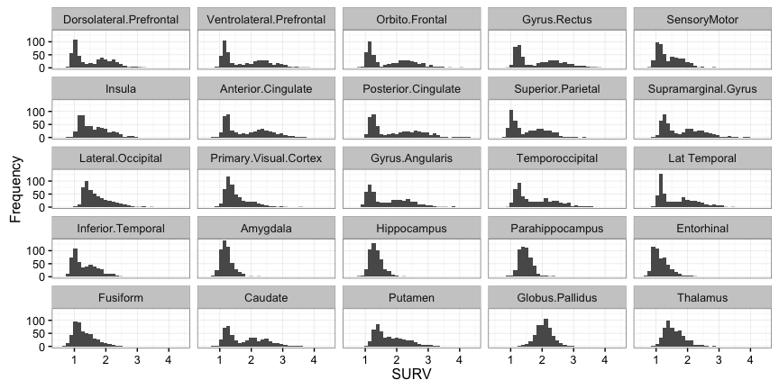
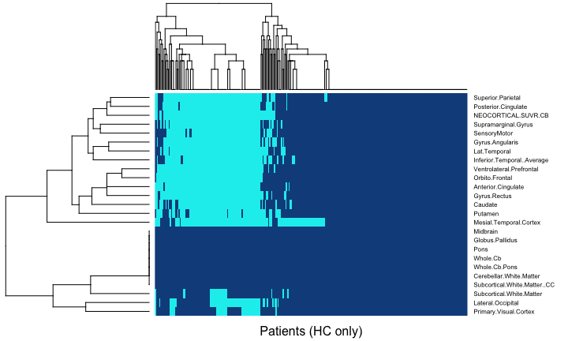
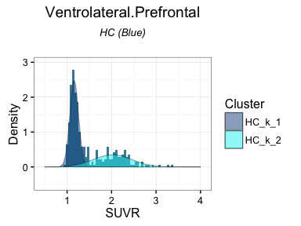
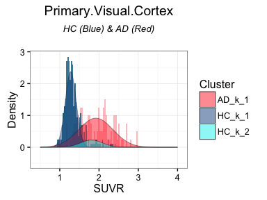
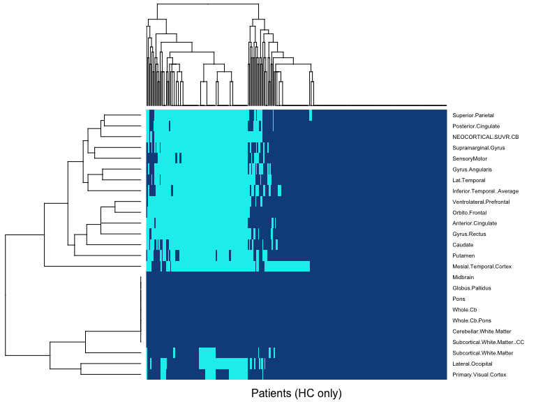
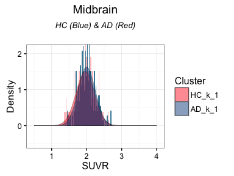
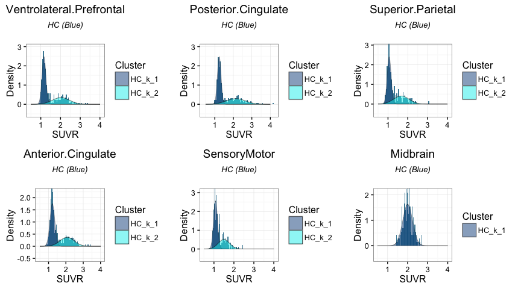
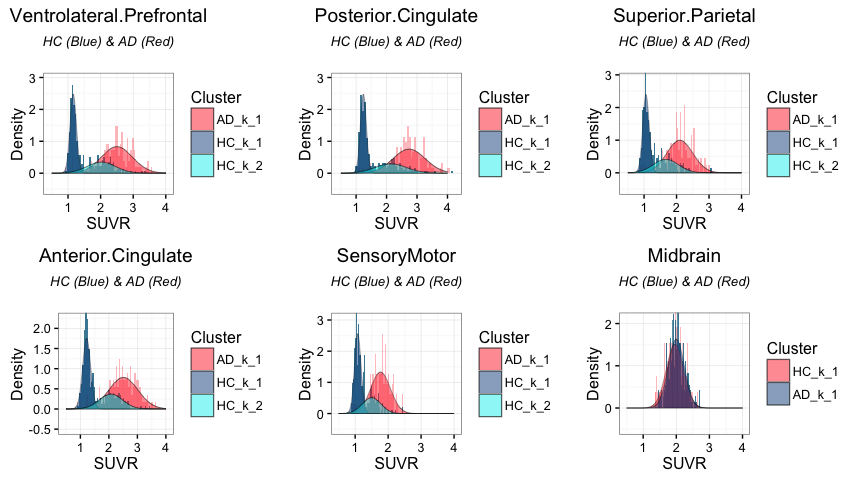
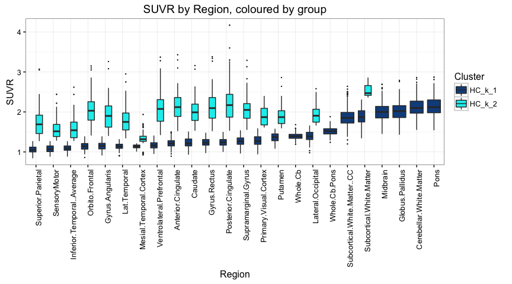

# Wombat - 2016 
Dr Zoe van Havre  


## Who am I?

- PhD in statistics, from QUT \& Paris-Dauphine
- I live in Brisbane, by way of Canada, New Zealand, and various places in between.
- *Key areas*:
    -  Bayesian statistics
    - Mixture and hidden Markov models, 
    - Bio-statistics/informatics/security,
- *Research interests*
    - data driven, accessible, intuitive tools
    - **making data analysis easier**


## What drives me?

The most common question asked since I started to pursue Statistics has been

<div class="centered">
**"Why...?"**
</div>

- I have three reasons:

1. A sense of urgency,
2. tantalizing hope,
3. boundless excitement.


# Urgency?

## Can we keep up?

- The exponetial growth of computing has not slowed down.
- New types of data and new challenges require new approaches
- 

----------------


# Hope...


## Not all change is bad
- Everyone is coming onboard! amazing advances
- Data-science is a thing now
- We are standing on a methodological goldmine...
    - **the traditional way**: 
        - Develop methods based on large sample theory.  
        - Adapt / make assumptions. to deploy on realistic sample sizes
    - **the future?** 
        - Rework common tools to be closer to underlying theory
        - This usually means Bayesian, yes. Sorry. 
        - Asymptotic theory $\rightarrow$ Methods $\rightarrow$ Big Data  $\rightarrow$ Theoretically Supported Results
    
    
## 3. Excitement!

Amazing things happen when data analysis combines

- clear research questions, 
- suitable tools, and 
- appropriate data


## A short story | overfitted mixtures and Alzheimer's Disease


## Key background


### What you need to know

- Alzheimer's Disease (AD) is something we need to address
- disease development is very slow
- no cognitive changes for $\geq$ 20 years
- once changes evident, extensive physical damage
    - Amyloid $\beta$ deposits
    - Neuro tangles
    - Atrophy
- Tests which assess physical change are $ $ $ and intrusive


## How can we help improve early detection

To better tackle AD, we need to be able to treat it earlier.

- we know little about how AD behaves in its early stage
- could compare known cases to controls, 
    - does not target early stage of AD
- **would like to identify individuals likely to be in early stage of AD**
 
## How? 

- large repository of data exists thanks to AIBL study 
- many data types, potential variables, time points, and sources
- possibilites = *endless* (thousands of potential approaches)
- What now...?

## The Data

The study consists of 507 individuals, composed of Healthy Controls (HC), MCI, and AD patients.


```
## 
##  AD MCI  HC 
## 103 114 290
```

------



# Overfitting with Zmix

## Algorithm
- modelling requires no additional assumptions beyond defaults
- extra covariates can be explored later 
    - could also use mixtures of regressions too... 
    - > assumptions and decisions to make later on

- Link to github

- sample code for 1 region

-------




--------------



-----------




----------


-----------




## Results

- Majority of regions result in two clusters, 
- of similar prevalence in the HC samples, 
- Same individuals were allocated to higher mean clusters
- The HC clusters with larger means resemble the distribu=on of SUVR in AD, shiXed to a lower mean, as would be expected in early stages of the disease. 
- They also follow similar paYerns to the AD values

-------



-------------





## Slide with image


