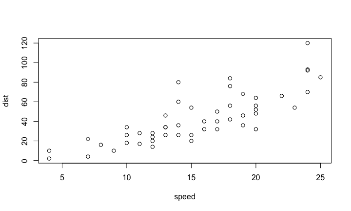

# Wombat - 2016 
Dr Zoe van Havre  
11 February 2016  

## Who am I?

- PhD in statistics, from QUT \& Paris-Dauphine
- I live in Brisbane, by way of Canada, New Zealand, and various places in between.
- *Key areas*:
    -  Bayesian statistics
    - Mixture and hidden Markov models, 
    - Bio-statistics/informatics/security,
- *Research interests*
    - data driven, accessible, intuitive tools
    - **making data analysis easier**

## What drives me?

The most common question asked since I started to pursue Statistics has been

**"Why...?"**

- I have three reasons:

1. A sense of urgency,
2. tantalizing hope,
3. boundless excitement.

# 1. Urgency?

----------------

<iframe src="Images/hc_diff_means.png" style="height: 200px"></iframe>

## 2. Hope...

- Everyone is coming onboard! amazing advances
- Data-science is a thing now
- We are standing on a methodological goldmine...
    - **the traditional way** 
    - Asymptotic theory  $\rightarrow$ Methods $\rightarrow$ adapt for small sample sizes (i.e. make assumptions) $\rightarrow$ Data $\rightarrow$ Results...ish?
    - **the future?** 
    - Asymptotic theory $\rightarrow$ Methods $\rightarrow$ Big Data  $\rightarrow$ Theoretically Supported Results
    
    
## 3. Excitement!

Amazing things happen when data analysis combines

- clear research questions, 
- suitable tools, and 
- appropriate data

## A short story | overfitted mixtures and Alzheimer's Disease

## Key background

### What you need to know

- Alzheimer's Disease (AD) is something we need to address
- disease development is very slow
- no cognitive changes for $\geq$ 20 years
- once changes evident, extensive physical damage
    - Amyloid $\beta$ deposits
    - Neuro tangles
    - Atrophy
- Tests which assess physical change are $ $ $ and intrusive

## How can we help improve early detection

To better tackle AD, we need to be able to treat it earlier.

- we know little about how AD behaves in its early stage
- could compare known cases to controls, 
    - does not target early stage of AD
- **would like to identify individuals likely to be in early stage of AD**
 
## How? 

- large repository of data exists thanks to AIBL study 
- many data types, potential variables, time points, and sources
- possibilites = *endless* (thousands of potential approaches)
- What now...?

-----------------------

## Slide with image

