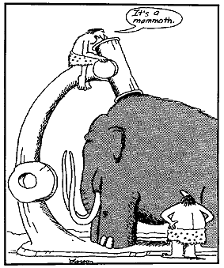
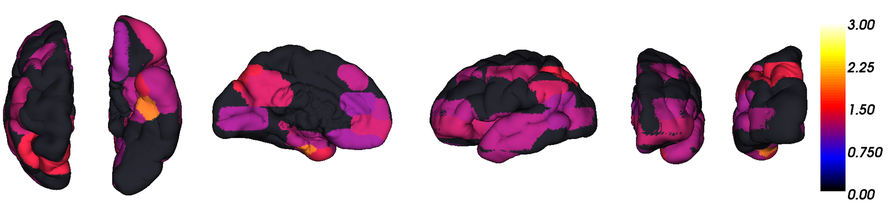
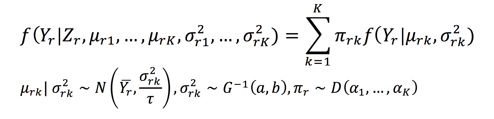
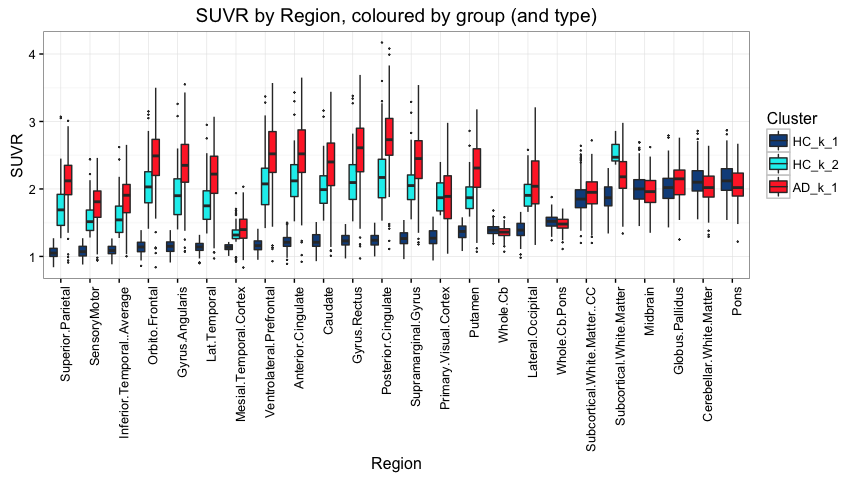
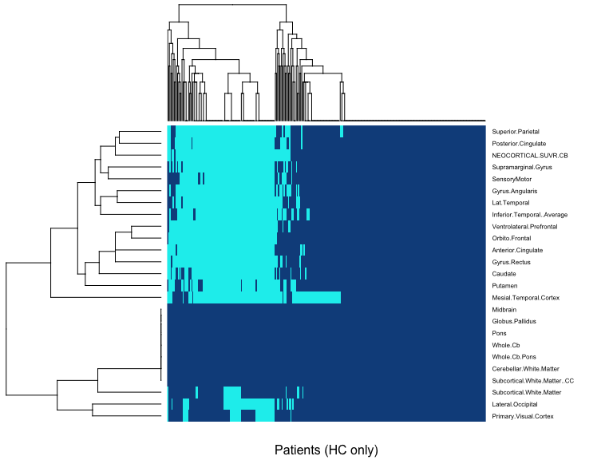

# Wombat - 2016 
Dr Zoe van Havre  
`r Sys.Date()`  


## Who am I?

- PhD in statistics, from QUT \& Paris-Dauphine
    - Honours in Bioinformatics (Griffith), BSc in Statistics (Otago)
- I now live in Brisbane, by way of a few places 
  <div align="center">
   
  </div>


## Who am I?

- *Key areas*
    -  Bayesian statistics
    - Mixture and hidden Markov models, 
      <div align="center">
       
      </div>
    - Bio-statistics/informatics/security,
- *Research interests*
    - Data driven, accessible, intuitive tools.
    - **Making data analysis easier!**


## What drives me?

The most common question asked since I started to pursue Statistics has been:

<div class="centered" >
**"Why...?"**
</div>

I can share my three reasons!

1. A sense of urgency,
2. tantalizing hope, and
3. boundless excitement.


## Urgency | Race against inexorable growth

* The exponential growth of computing is not slowing down!

* It is notoriously hard for our brain to really comprehend what this means. 

* If we symbolize ALL of our computational advances to date by this dot $\rightarrow \cdot$

 *  In 10 years this is what we will be dealing with:
 * 


## Hope 
* Opinions are changing fast, and everyone is coming on-board 
* There are low hanging fruits to make better, easier tools.
    * __the traditional way__: adapt asymptotic theory to small sample sizes.
    * __the future__: to take advantage of the _features_ of Big Data (i.e. closer to the underlying truth).

## "Big" data
<div align="center">
</img>
</div>


## Excitement | Better tools make data analysis easier

* Amazing things happen when data analysis combines clear research questions,  appropriate data, and suitable, accessible tools.
      * __Accessibility__: easy to use and to understand what the tool does.
* People can often do more with less. 
* Simple models are less likely to be wrongly used. 
* It doesn't have to be just "analysis"! It can be exploration, discovery, and more than a little exciting. 


## Excitement
* <div align="center">
  </img>
  </div>


# A short story about Alzheimer's Disease| featuring... overfitted mixture models!


## Key background

* Alzheimer's Disease (AD) currently affects over 342,800 Australians, and this number is expected to rise to 900,000 by 2050.
* Cognitive changes occur late in the disease ($\geq$ 20 years).
* During this time, AD causes irreversible damage to the brain:
    - accumulation of **amyloid $\beta$**,
    - neurofibrillary tangles, 
    - overall atrophy.
* To better research and treat AD, we need to be able to treat it earlier.


## How?

__Aim: identify individuals likely to be in the early stage of AD.__

* Best detection tool we have:  imaging of __amyloid $\beta$__  
* Data is processed and aggregated for a set of regions (__"SUVR"__)
  <div align="center">
  </img>
  </div>
* SUVR available for 393 individuals
    * 290 HC, and 103 AD 
    
## Data overview |  Histograms of Healthy Controls (HC)


## "Healthy" control...? 

* Traditionally, we compared AD to HC, and so on...
* If all HC are truly healthy, that's great, but some might have the disease.
    - they did not look normally distributed!
* If different types of individuals are present and not modeled specifically, any conclusion drawn from comparing AD to HC may be skewed or entirely invalid. 
  - comparisons are blurred, inference limited
* Our main research interest is causing a problem!


## Undetected subgroups can cause problems...
<div align="center">
</img>


# Overfitting with Zmix| Data-driven modelling of mixture models with an unknown number of groups. 

## Overfitting with Zmix
 
 If the distribution of SUVR in each region depends on some unknown number of groups we have a _mixture distribution with an unknown number of groups_.

* Traditionally, these can be quite painful to model, but can now take more straightforward approach.
* __Fit too many groups__, and tell model to __empty out__ those not supported by the data.
* Bayesian method based on recent developments in Bayesian _asymptotic_ theory.
* Model + computational tools available in R package __Zmix__ for univariate mixture models.


## Overfitting with Zmix {.reveal}

_Model Assumptions_:  The distribution of the data depends on an __unknown__ number of Normally distributed groups, with unknown means and variances.

_Priors_

  * Conditionally conjugate, and $\approx$  non-informative.
  * __Prior weight of groups is $\approx$ zero.__
      - _i.e._ If there is no data to support a group, it will be assigned a weight close to zero.

_Computation_: 

* Gibbs sampler + Prior Parallel Tempering (PPT)


## Overfitting with Zmix | Model

<div align="center">

</img>
</div>


> - $k$: Group
> - $r$: Region
> - $Z$: Allocations
> - $\pi, \mu, \sigma^2$: Mixture weights, means and variances

## How it's done

Install the package

```r
devtools::install_github('zoevanhavre/Zmix') # Thank you Hadley!
library(Zmix)
```

Run the model with $K=5$ groups


```r
### <b> 
Zmix.Y<-Zmix_univ_tempered (Y, iter=50000, k=5)  
### </b>
```

Process the results

```r
Proc.Zmix.Y<-Process_Output_Zmix(Zmix.Y, Burn=25000)
```


[Check out the README for more examples](https://github.com/zoevanhavre/Zmix)


## Overfitting the SUVR data

* Keen to enforce few model assumptions (remaining parametric)
    * Assume nothing about how AD develops, spatially or longitudinally.
    * Consider univariate N. mixtures with unknown means and variances.
    * Consider HC data and AD data separately.

* $\rightarrow$ many, relatively simple models, with results we can explore and potentially use for further analyses.


# Results


## Results of Zmix
All regions were found to contain __one__ or __two__ normally distributed groups.

 * We chose to reduce results to the best model for each Region
      * (model averaging is an easy alternative)
 * We named the groups by increasing mean.
 
 
 
 
------

<slide class="segue dark background">
<hgroup class="auto-fadein">
<h2> What do these groups look like? </h2>
</hgroup>
<article id="sets-article-class" class="h1_class">
</article>
</slide>

## Mixture models: HC data 


## Mixture models: HC and AD data


-----
<slide class="segue dark background">
<hgroup class="auto-fadein">
<h2> OK, let's zoom out </h2>
</hgroup>
<article id="sets-article-class" class="h1_class">
</article>
</slide>


## SUVR by group: HC


## SUVR by group: HC and AD


## Weight of second cluster




------

<slide class="segue dark background">
<hgroup class="auto-fadein">
<h2> Looking at individuals </h2>
</hgroup>
<article id="sets-article-class" class="h1_class">
</article>
</slide>


## Structure of results


------------

<slide class="segue dark background">
<hgroup class="auto-fadein">
<h2> What about other variables? </h2>
</hgroup>
</slide>


HC: Age by Group
------------------------------

<div align="center">
</img>

HC: "Memory Complainers" by Group
------------------------------


## Genotype by Group


# Summary of Results

## Summary| What have we seen?

* __one__ or __two__ Normal groups were likely to be present,
* Distribution group 2 resembled the distribution of SUVR in AD in regions where it was found, but __shifted to a lower mean__
* Weight of 2nd group similar in regions found to contain one, 
* Allocation to 2nd group strongly correlated across individuals,
* comparison with other variable appears to corroborate this

Overall, we found data-driven subgroups to target a group of individuals appear to be on track to AD

## Summary

- Can compute measures relating to quantities of interest, by aggregating posterior probabilities across different models 
    - i.e. to identify individuals most likely to be of interest, 
    add the probabilities of being allocated to a the second group for each individual
    $$ \sum P(\text{Model is true}) \times P(\text{ID is in group 2})$$
    
- but locating second groups also allows us to proceed with more elaborate analyses
- more importantly, it allows us to improve metrics which target the early stages of the disease 
    - Can focus on prediction for putative __early AD__ group, etc
    - _Easier_: use  __early AD__ instead of AD to recompute existing metrics 
  

# Thank you!
