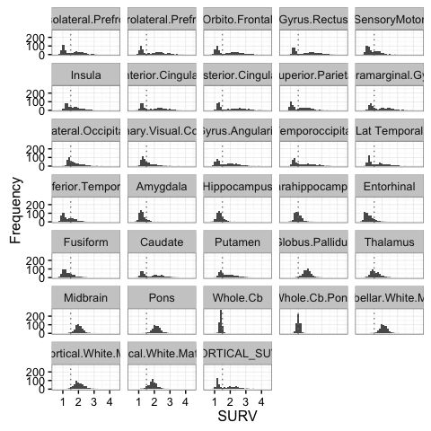
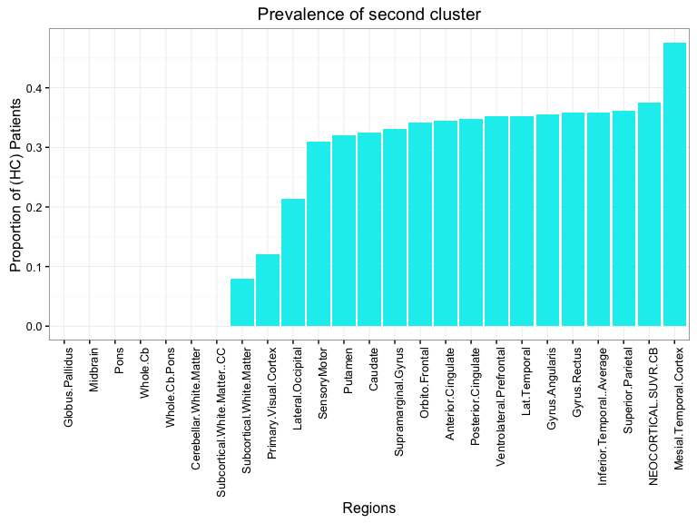

# Wombat - 2016 
Dr Zoe van Havre  


```
## 
## Attaching package: 'gplots'
```

```
## The following object is masked from 'package:stats':
## 
##     lowess
```

```
## 
## Attaching package: 'dplyr'
```

```
## The following objects are masked from 'package:stats':
## 
##     filter, lag
```

```
## The following objects are masked from 'package:base':
## 
##     intersect, setdiff, setequal, union
```

```
## -------------------------------------------------------------------------
```

```
## You have loaded plyr after dplyr - this is likely to cause problems.
## If you need functions from both plyr and dplyr, please load plyr first, then dplyr:
## library(plyr); library(dplyr)
```

```
## -------------------------------------------------------------------------
```

```
## 
## Attaching package: 'plyr'
```

```
## The following objects are masked from 'package:dplyr':
## 
##     arrange, count, desc, failwith, id, mutate, rename, summarise,
##     summarize
```

```
## 
## Welcome to dendextend version 1.1.2
## 
## Type ?dendextend to access the overall documentation and
## browseVignettes(package = 'dendextend') for the package vignette.
## You can execute a demo of the package via: demo(dendextend)
## 
## More information is available on the dendextend project web-site:
## https://github.com/talgalili/dendextend/
## 
## Contact: <tal.galili@gmail.com>
## Suggestions and bug-reports can be submitted at: https://github.com/talgalili/dendextend/issues
## 
## 			To suppress the this message use:
## 			suppressPackageStartupMessages(library(dendextend))
```

```
## 
## Attaching package: 'dendextend'
```

```
## The following object is masked from 'package:dplyr':
## 
##     %>%
```

```
## The following object is masked from 'package:stats':
## 
##     cutree
```

```
## Loading required package: ggplot2
```

```
## Loading required package: tidyr
```

```
## 
## Attaching package: 'tidyr'
```

```
## The following object is masked from 'package:dendextend':
## 
##     %>%
```

```
## Warning: replacing previous import by 'grid::unit' when loading 'sjPlot'
```


## Who am I?

- PhD in statistics, from QUT \& Paris-Dauphine
- I live in Brisbane, by way of Canada, New Zealand, and various places in between.
- *Key areas*:
    -  Bayesian statistics
    - Mixture and hidden Markov models, 
    - Bio-statistics/informatics/security,
- *Research interests*
    - data driven, accessible, intuitive tools
    - **making data analysis easier**


## What drives me?

The most common question asked since I started to pursue Statistics has been

<div class="centered">
**"Why...?"**
</div>

- I have three reasons:

1. A sense of urgency,
2. tantalizing hope,
3. boundless excitement.


# Urgency?

## Can we keep up?

- The exponetial growth of computing has not slowed down.
- New types of data and new challenges require new approaches
- 

----------------


# Hope...


## Not all change is bad
- Everyone is coming onboard! amazing advances
- Data-science is a thing now
- We are standing on a methodological goldmine...
    - **the traditional way**: 
        - Develop methods based on large sample theory.  
        - Adapt / make assumptions. to deploy on realistic sample sizes
    - **the future?** 
        - Rework common tools to be closer to underlying theory
        - This usually means Bayesian, yes. Sorry. 
        - Asymptotic theory $\rightarrow$ Methods $\rightarrow$ Big Data  $\rightarrow$ Theoretically Supported Results
    
    
## 3. Excitement!

Amazing things happen when data analysis combines

- clear research questions, 
- suitable tools, and 
- appropriate data


## A short story | overfitted mixtures and Alzheimer's Disease


## Key background


### What you need to know

- Alzheimer's Disease (AD) is something we need to address
- disease development is very slow
- no cognitive changes for $\geq$ 20 years
- once changes evident, extensive physical damage
    - Amyloid $\beta$ deposits
    - Neuro tangles
    - Atrophy
- Tests which assess physical change are $ $ $ and intrusive


## How can we help improve early detection

To better tackle AD, we need to be able to treat it earlier.

- we know little about how AD behaves in its early stage
- could compare known cases to controls, 
    - does not target early stage of AD
- **would like to identify individuals likely to be in early stage of AD**
 
## How? 

- large repository of data exists thanks to AIBL study 
- many data types, potential variables, time points, and sources
- possibilites = *endless* (thousands of potential approaches)
- What now...?


--------------



-----------


-----------


-------



-------------


## Slide with image


