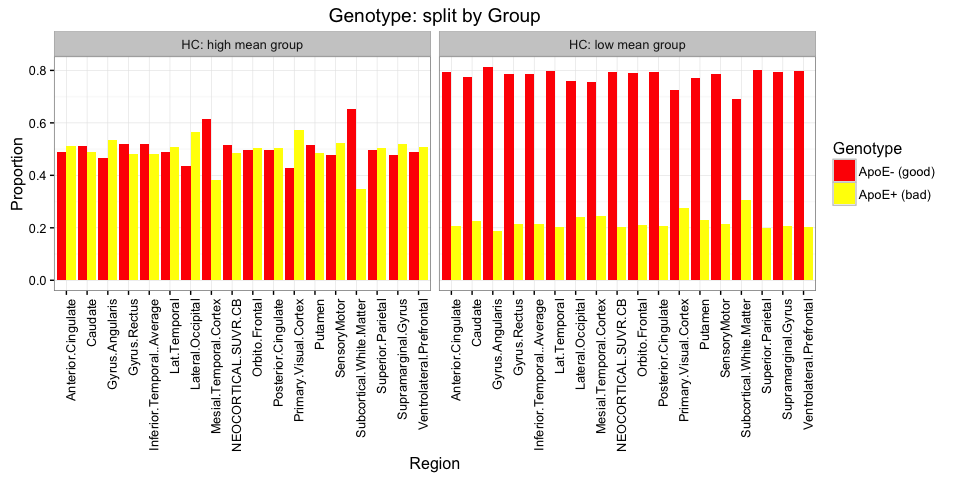

# Wombat - 2016 
Dr Zoe van Havre  
`r Sys.Date()`  


## Who am I?

- PhD in statistics, from QUT \& Paris-Dauphine
    - Honours in Bioinformatics, BSc Statitics
- I now live in Brisbane, by way of Canada, Saipain, New Zealand, and various places in between. 
- *Key areas*:
    -  Bayesian statistics
    - Mixture and hidden Markov models, 
    - Bio-statistics/informatics/security,
- *Research interests*
    - data driven, accessible, intuitive tools
    - **making data analysis easier...**


## What drives me?

The most common question asked since I started to pursue Statistics has been:

<div class="centered" >
**"Why...?"**
</div>

I can share my three reasons!

1. A sense of urgency,
2. tantalizing hope, and
3. boundless excitement.


## Urgency | Race against inexorable growth

* The exponential growth of computing is not slowing down!

* It is notoriously hard for our brain to really comprehend what this means. 

* If we symbolise ALL of our computational advances to date by this dot $\rightarrow \cdot$

 *  In 10 years this is what we will be dealing with:
 * 


## Hope 
* Opinions are changing fast, and everyone is coming onboard 
* There are low hanging fruits to make better, easier tools.
    * __the traditional way__: adapt asymptotic theory to small sample sizes.
    * __the future__: to take advantage of the _features_ of Big Data (i.e. closer to the underlying truth).

## "Big" data
<div align="center">
</img>
</div>


## Excitement | Better tools make data analysis easier

* Amazing things happen when data analysis combines clear research questions,  appropriate data, and suitable, accessible tools.
      * __Accessibility__: easy to use and to understand what the tool does.
* People can often do more with less. 
* Simple models are less likely to be wrongly used. 
* It doesnt have to be just "analysis"! It can be exploration, discovery, and more than a little exciting. 


## Excitement
* <div align="center">
  </img>
  </div>


# A short story about Alzheimer's Disease| featuring... overfitted mixture models!


## Key background

* Alzheimer's Disease (AD) currently affects over 342,800 Australians, and this number is expected to rise to 900,000 by 2050.
* Cognitive changes occur late in the disease ($\geq$ 20 years).
* During this time, AD causes irreversible damage to the brain:
 - accumulation of **amyloid $\beta$**,
 - neurofibrillary tangles, 
 - overall atrophy.
* To better research and treat AD, we need to be able to treat it earlier.


## How?

__Aim: identify individuals likely to be in the early stage of AD.__

* Best detection tool we have:  imaging of __amyloid $\beta$__  
* Data is procesed and aggregated for a set of regions (__"SUVR"__)
  <div align="center">
  </img>
  </div>
* SUVR available for 393 individuals
    * 290 HC, and 103 AD 
    
## How?

__Aim: identify individuals likely to be in the early stage of AD.__

* Traditionally, we compared AD to HC, leading to a threshold score (1.5!) 
* But we know we cannot diagnose early stage AD! 
    - Some must be present in the controls
* If different types of individuals are present and not modelled, any conclusion drawn from comparing AD to HC may be skewed or entirely invalid. 
* Our research problem is causing a problem... 

-------
## Undetected subgroups can cause problems...
<div align="center">
</img>


## Modelling hidden subgroups with mixtures
 
 If the distribution of SUVR in each region depends on some unknown number of groups, we can use _overfitted mixture models_ with __Zmix__ to model these.
 
* Assumes only that groups are normally distributed
* We will fit univariate Normal mixture models
    -assume nothing about how AD develops spatially or longitudinally
* We will model HC and AD data separetely too

* This leads to several, relatively simple models, with many unknowns


## The Data| The study consists of 290 Healthy Controls (HC), and 103 AD patients.


```
#> 
#>  AD MCI  HC 
#> 103 114 290
```

------


# Overfitting with Zmix

## Overfitted mixture models
We can model an unknown number of groups using **overfitted mixture models**, a Bayesian method found in the R package "Zmix".

  * too many groups are included in a mixture model
  * extra groups __empty out__
  * probability of number of occupied groups  
  * data driven and fully parametric
  * Bayesian, but straightforward 
  * Assumes only that up to $K$ groups are normally distributed with an unknown mean and variance. 

## How it's done

Install the package

```r
install_github('zoevanhavre/Zmix') # Thank you Hadley!
library(Zmix)
```

Run the model with $K=5$ groups


```r
### <b> 
Zmix.Y<-Zmix_univ_tempered (Y, iter=50000, k=5)  
### </b>
```

Process the results

```r
Proc.Zmix.Y<-Process_Output_Zmix(Zmix.Y, Burn=25000)
```


[Check out the README for more examples](https://github.com/zoevanhavre/Zmix)


# Results

## Initial results

All regions were found to contain __one or two__ normally distributed groups.

> * We chose to reduce results to the best model for each Region
>     * (model averaging is an easy alternative)
> * We named the groups by increasing mean

------

<slide class="segue dark background">
<hgroup class="auto-fadein">
<h2> What do these groups look like? </h2>
</hgroup>
<article id="sets-article-class" class="h1_class">
</article>
</slide>

## Mixture models: HC data 


## Mixture models: HC and AD data


-----
<slide class="segue dark background">
<hgroup class="auto-fadein">
<h2> OK, let's zoom out </h2>
</hgroup>
<article id="sets-article-class" class="h1_class">
</article>
</slide>


## SUVR by group: HC


## SUVR by group: HC and AD


## Weight of second cluster


------

<slide class="segue dark background">
<hgroup class="auto-fadein">
<h2> Looking at individuals </h2>
</hgroup>
<article id="sets-article-class" class="h1_class">
</article>
</slide>


## Structure of results


------------

<slide class="segue dark background">
<hgroup class="auto-fadein">
<h2> What about other variables? </h2>
</hgroup>
</slide>


HC: "Memory Complainers" by Group
------------------------------


## Genotype by Group




## Summary

* __one__ or __two__ Normal groups likely to be present. 
* Prevalence of 2nd group similar across regions, 
* Allocation to 2nd group highly correlated across individuals,
* Distribution of HC clusters suggests
    - SURV dist uniformly if you remove high mean group
    - high mean groups closely resembles the distribution of SUVR in AD, but shifted to a lower mean


## overview

- data-driven subgroups show a group of individuals appear to be on track to AD
- this can be corroborated with additional comparisons
- could compute aggregate posterior probabilities across models
    - i.e. cummulative probability of being allocated to a larger group for each individuals 
- but locating second groups also allows us to proceed with more elaborate analyses
- more importantly, it allows us to improve metrics which target the early stages of the diease 
    - Can focus on prediction for putative __early AD__ group, etc
    - _Easier_: metrics derived from __AD VS HC__ comparisons can be updated to use  __early AD__ instead of  AD
    


------
<div align="center">
<iframe width="560" height="315" src="http://www.youtube.com/embed/9bZkp7q19f0?rel=0" frameborder="0" allowfullscreen></iframe>
   </iframe>
</div>


------

<slide class="segue dark background">
<hgroup class="auto-fadein">
<h2>Light Fade</h2>
</hgroup>
<article id="sets-article-class" class="h1_class">
</article>
</slide>
