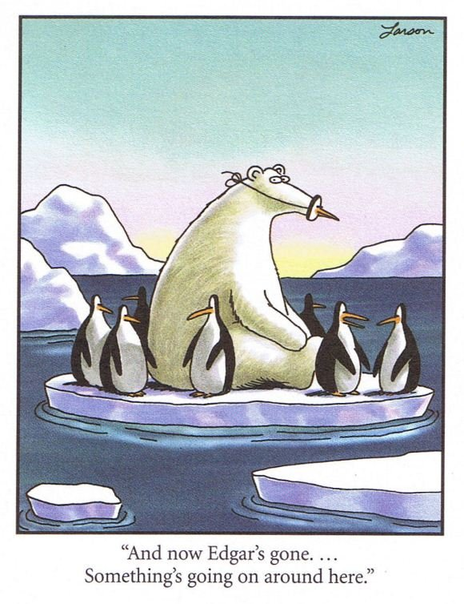
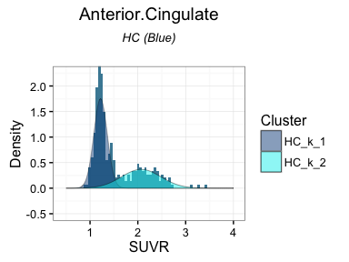

# Wombat - 2016 
Dr Zoe van Havre  
`r Sys.Date()`  


## Who am I?

- PhD in statistics, from QUT \& Paris-Dauphine
- I live in Brisbane, by way of Canada, New Zealand, and various places in between.
- *Key areas*:
    -  Bayesian statistics
    - Mixture and hidden Markov models, 
    - Bio-statistics/informatics/security,
- *Research interests*
    - data driven, accessible, intuitive tools
    - **making data analysis easier**


## What drives me?

The most common question asked since I started to pursue Statistics has been:

<div class="centered" >
**"Why...?"**
</div>

I can share my three reasons!

1. A sense of urgency,
2. Tantalizing hope,
3. Boundless excitement.


## Urgency | Race against inexorable growth

* The exponential growth of computing is not slowing down!

* It is notoriously hard for our brain to really comprehend what this means. 

* If we symbolise ALL of our computational advances to date by this dot $\rightarrow \cdot$

 *  In 10 years this is what we will be dealing with:
 * 


## Hope 
* Opinions are changing fast, and everyone is coming onboard 
* There are low hanging fruits to make better, easier tools.
    * __the traditional way__: adapt asymptotic theory to small sample sizes.
    * __the future__: to take advantage of Big Data (i.e. closer to truth)
    * <div align="center">
    </img>
    </div>
   

## Excitement | Better tools make data analysis easier

* Amazing things happen when data analysis combines clear research questions,  appropriate data, and suitable, accessible tools.
      * __Accessibility__: easy to use and to understand what the tool does.
* People can often do more with less. 
* Simple models are less likely to be wrongly used. 


## Excitement | Better tools make data analysis easier!

 It doesnt have to be just "analysis"! It can be exploration, discovery, and more than a little exciting. 

<div align="center">
</img>
</div>


# A short story about Alzheimer's Disease| featuring... overfitted mixture models!


## Key background

Alzheimer's Disease (AD) currently affects over 342,800 Australians, and this number is expected to rise to 900,000 by 2050.

Cognitive changes indicate something is amiss, but these occur late in the disease ($\geq$ 20 years).

During this time, AD causes irreversible damage to the brain:

> - accumulation of **amyloid $\beta$**,
> - neurofibrillary tangles, 
> - overall atrophy.

To better research and treat AD, we need to be able to treat it earlier.


## How can we help improve early detection

To better tackle AD, we need to be able to treat it earlier.

__Goal: identify individuals likely to be in the early stage of AD.__

* Large repository of data exists thanks to AIBL study  (REF)
* SUVR available for 393 individuals, for a set of _brain regions_ (pre-processed)
    * 290 HC, 103 AD 
* Traditionally first thing to do is compare AD to HC, of course
* But some of the clinically "Healthy" HC individuals these must be in _early stage AD_

-------


<div align="center">
</img>


-----------

* If different types of individuals are present and not modelled, any conclusion drawn from comparing AD to HC may be skewed or entirely invalid. 
* Our research problem is causing a problem...  
* Assume distribution of SUVR in each region _may_ depend on unknown number of groups
* Assume these are normally distributed
* Assume nothing about how AD develops spatially and longitudinally
    * Model each region separetely.
* We want to know if there are subgroups in the HC irrespective of AD results
    * Model HC and AD seperately.
* this leads to several, relatively simple models, but with a lot of unknowns
    * number of groups, all group parameters
* Overfitted mixture models can be useful here.

## The Data

The study consists of 507 individuals, composed of Healthy Controls (HC), MCI, and AD patients.


```
#> 
#>  AD MCI  HC 
#> 103 114 290
```

------


# Overfitting with Zmix

## Overfitted mixture models
We can model an unknown number of groups using **overfitted mixture models**, a Bayesian method found in the R package "Zmix".

  * too many groups are included in a mixture model
  * extra groups __empty out__
  * probability of number of occupied groups  
  * data driven and fully parametric
  * Bayesian, but straightforward 
  * Assumes only that up to $K$ groups are normally distributed with an unknown mean and variance. 

## How it's done

Install the package

```r
install_github('zoevanhavre/Zmix') # Thank you Hadley!
library(Zmix)
```

Run the model with $K=5$ groups


```r
### <b> 
Zmix.Y<-Zmix_univ_tempered (Y, iter=50000, k=5)  
### </b>
```

Process the results

```r
Proc.Zmix.Y<-Process_Output_Zmix(Zmix.Y, Burn=25000)
```


[Check out the README for more examples](https://github.com/zoevanhavre/Zmix)


# Results


--------------


--------------



-----------


----------


## Structure of results


### Genotype by Groups


## Memory Status by Groups


## Summary

* __one__ or __two__ Normal groups likely to be present. 
* Prevalence of 2nd group similar across regions, 
* Allocation to 2nd group highly correlated across individuals,
* Distribution of HC clusters suggests
    - SURV dist uniformly if you remove high mean group
    - high mean groups closely resembles the distribution of SUVR in AD, but shifted to a lower mean


------
<div align="center">
<iframe width="560" height="315" src="http://www.youtube.com/embed/9bZkp7q19f0?rel=0" frameborder="0" allowfullscreen></iframe>
   </iframe>
</div>


------


<slide class="segue dark background">
<hgroup class="auto-fadein">
<h2>Light Fade</h2>
</hgroup>
<article id="sets-article-class" class="h1_class">
</article>
</slide>
